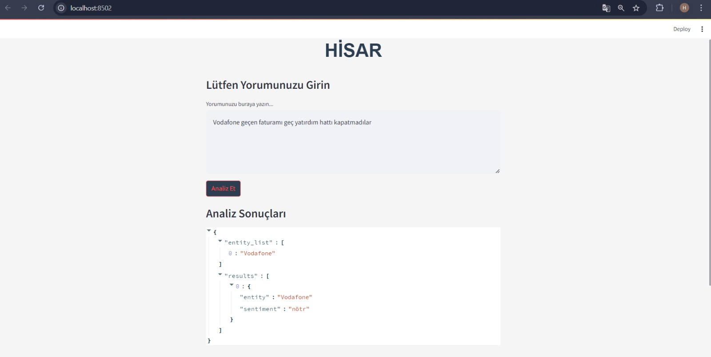

# Ac-khack2024TDD-
prewiew.jpeg
Bu repository Bilişim vadisi ve Teknofest işbirliği ile düzenlenen Teknofest 2024 NLP yarışması Hisar takımının projesi için düzenlenmiştir.

## Proje yapısı

Regression with Web Scraping 
├── Yorumbudur.com web scarping.ipynb  
├── app.py 
├── ner_model.zip 
├── sikayetvar.com web scarping.ipynb 
├── son_model.ipynb 
├── sunucu.py 
└── trendyol superbox web scarping.ipynb

## Gereklilikler

Lütfen aşağıdaki gereklilikleri indirdikten sonra notebook dosyalarını çalıştırın:

- Python 3.8+
- spacy
- numpy
- streamlit

pip paket yöneticisni kullanarak gerekli paketleri yükliyebilirsiniz:

pip install pandas numpy scikit-learn pycaret matplotlib seaborn streamlit

# Kullanım

## ner_model.zip
Spacy modelinin zip dosyasır zipden çıkartın.

## app.py
Streamlit web uygulama dosyasıdır gerekli bağımlıkları indirdikten sonra "#streamlit run app.py" ile çalıştırabilirsiniz.

#EN

This repository is organized for the Hisar team’s project for the Teknofest 2024 NLP competition, held in collaboration with Bilişim Vadisi and Teknofest.

Project Structure

Regression with Web Scraping 
├── Yorumbudur.com web scraping.ipynb  
├── app.py 
├── ner_model.zip 
├── sikayetvar.com web scraping.ipynb 
├── son_model.ipynb 
├── server.py 
└── trendyol superbox web scraping.ipynb
Requirements

Please ensure you have the following requirements installed before running the notebook files:

    Python 3.8+
    spacy
    numpy
    streamlit

You can install the required packages using pip:

bash

pip install pandas numpy scikit-learn pycaret matplotlib seaborn streamlit

Usage
ner_model.zip

Extract the zip file containing the Spacy model.
app.py

This is the Streamlit web application file. After installing the necessary dependencies, you can run it with streamlit run app.py.
Web Scraping

The web scraping files can be modified and updated as needed.
server.py

If you want to run the application on a local server, you can use this file.

## Web scraping 

## sunucu.py

